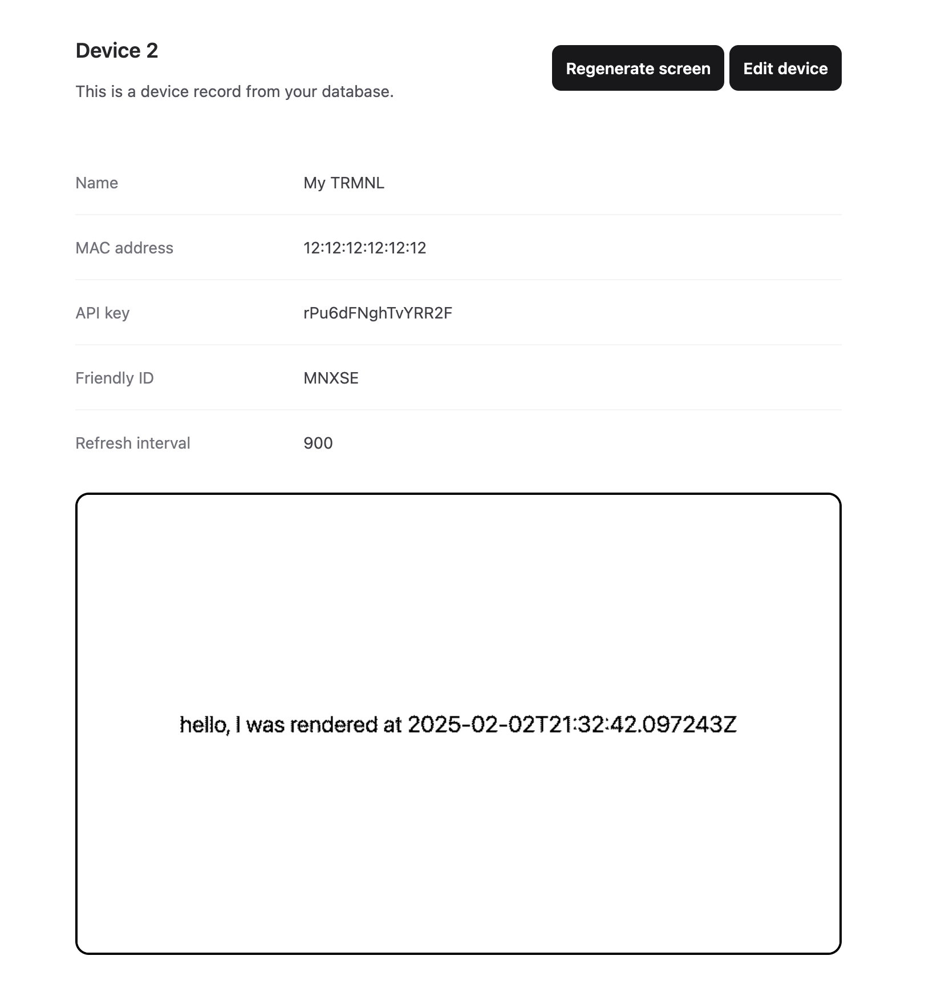

# TRMNL BYOS (Bring-Your-Own-Server) - Phoenix

This is a standalone ["bring-your-own-server"](https://docs.usetrmnl.com/go/diy/byos) for [TRMNL](https://usetrmnl.com/) devices.

It's a standard Phoenix application with support for multiple TRMNL devices. A playlist rotates through multiple screens, regenerating them every 15 minutes.

Whether you have official TRMNL hardware or have [built your own](https://docs.usetrmnl.com/go/diy/byod), you can always re-flash [the firmware](https://github.com/usetrmnl/firmware) and point at your very own self-hosted server. This is a basic implementation of such a server.

## Setup

Prerequisites:

- [ImageMagick](https://imagemagick.org/script/download.php)
- [chromedriver](https://developer.chrome.com/docs/chromedriver/downloads)
- [Google Chrome](https://www.google.com/chrome/)

To start your Phoenix server:

- Run `mix setup` to install and setup dependencies
- Start Phoenix endpoint with `mix phx.server` or inside IEx with `iex -S mix phx.server`

Now you can visit [`localhost:4000`](http://localhost:4000) from your browser.

## Interesting files to check out

- `lib/trmnl/screen.ex` - the core logic for rendering and updating screen BMPs
- `lib/trmnl/screen_generator.ex` - a GenServer that regenerates screens every 15 minutes
- `lib/trmnl/screens/hello.ex` - a basic example screen
- `lib/trmnl_web/controllers/api_controller.ex` - the API controller where devices phone home

## Looking for another language?

- [usetrmnl/byos_sinatra](https://github.com/usetrmnl/byos_sinatra) (Ruby)
